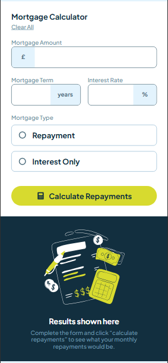
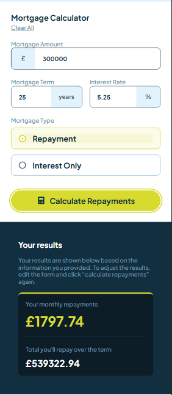
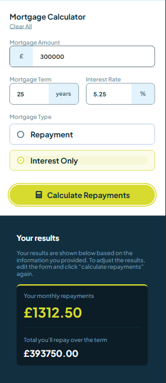
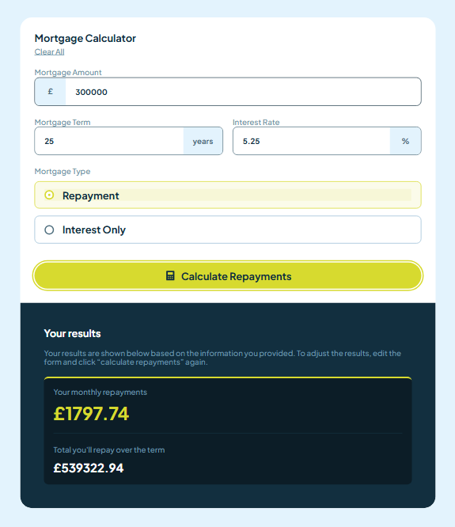
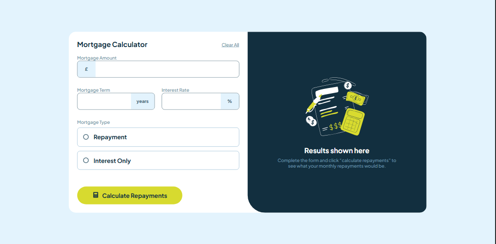
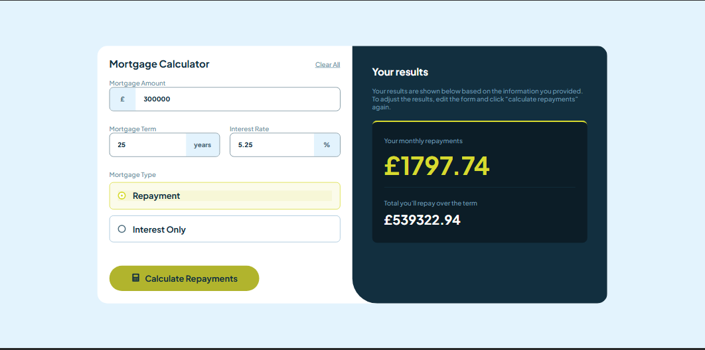
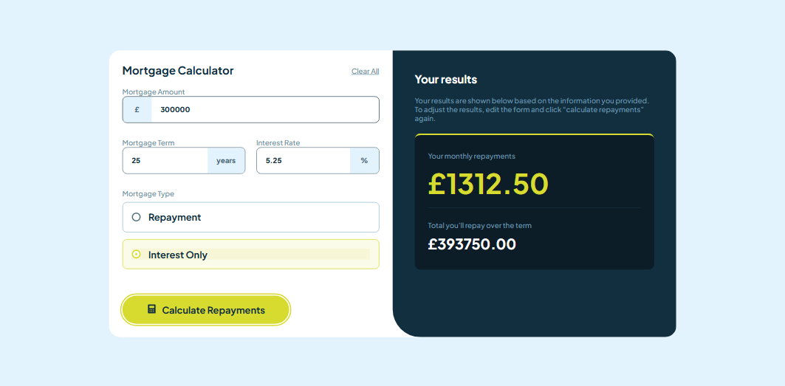
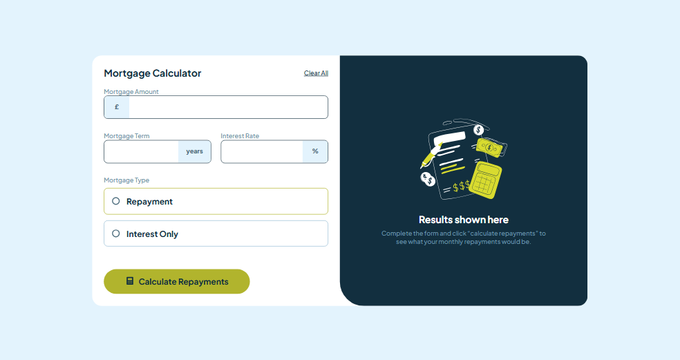
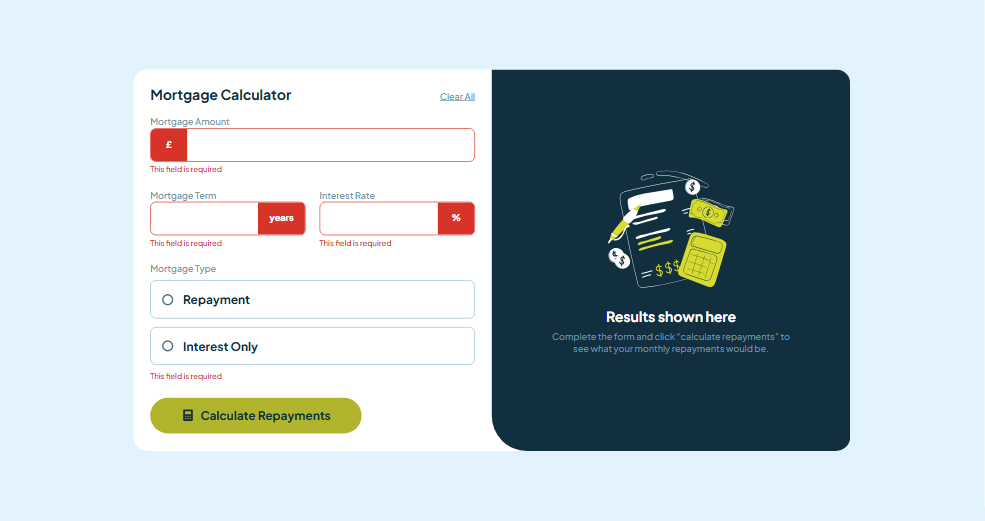

# mortgage-repayment-calculator-main
mortgage-repayment-calculator

This is a solution to the [mortgage-repayment-calculator on Frontend Mentor](https://www.frontendmentor.io/challenges/mortgage-repayment-calculator-Galx1LXK73). Frontend Mentor challenges help you improve your coding skills by building realistic projects. 

## Table of contents

- [Overview](#overview)
  - [Screenshot](#screenshot)
  - [Links](#links)
- [My process](#my-process)
  - [Built with](#built-with)
  - [What I learned](#what-i-learned)
  - [Continued development](#continued-development)
- [Author](#author)

## Overview

### Screenshot

These are my screenshots showing how the project turned out.

- Mobile design:





- Tablet design:





- Desktop design:





- Active state:


- Hover state:



- Error state:




### Links

- Solution URL: [My Solution](https://github.com/gillaercio/mortgage-repayment-calculator-main)

## My process

### Built with

- Semantic HTML5 markup
- CSS custom properties
- Flexbox
- Mobile-first workflow
- JavaScript

### What I learned

I took advantage of this project to practice using **Pseudo-class**, **Pseudo-elements** and **Reset CSS** with **CSS** and **Calculations** and **Events** with **JavaScript**:

Pseudo-element

```css
.form__type > div:has(input[type="radio"]:checked) {
  border-color: var(--Lime);
  background-color: var(--Lime-alfa);
}
```

```css
*,
*::before,
*::after {
  margin: 0;
  padding: 0;
  box-sizing: border-box;
}
```

Calculations

```js
if (repaymentEl.checked) {
  const monthlyRate = interestRate / 12;
  const numberOfPayments = mortgageTerm * 12;

  monthlyPayment = (mortgageAmount * monthlyRate) / (1 - Math.pow(1 + monthlyRate, -numberOfPayments));
  totalPayment = monthlyPayment * numberOfPayments;
} else if (interestOnlyEl.checked) {
  monthlyPayment = (mortgageAmount * interestRate) / 12;
  totalPayment = monthlyPayment * mortgageTerm * 12;
}
```

Events

```js
[mortgageAmountEl, mortgageTermEl, interestRateEl].forEach(input => {
  input.addEventListener("input", () => {
    clearFieldError(input);
  });
});

[repaymentEl, interestOnlyEl].forEach(radio => {
  radio.addEventListener("change", () => {
    typeErrorMsg.textContent = "";
    typeErrorMsg.classList.remove("visible");
  });
});
```

### Continued development

I would like to improve the use of the **HTML**, **CSS** and **JavaScript**.

## Author

- Frontend Mentor - [@gillaercio](https://www.frontendmentor.io/profile/gillaercio)
- Github - [My Github](https://github.com/gillaercio)
- LinkedIn - [My LinkedIn](https://www.linkedin.com/in/gildman-la%C3%A9rcio/)